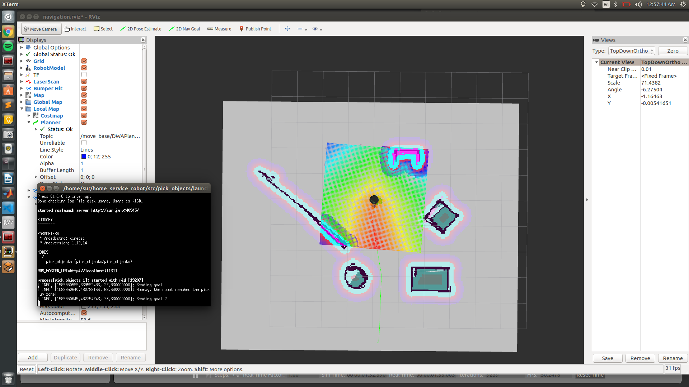

[](https://www.udacity.com/robotics)

# Udacity Nanodegree: Robotics Software Engineer

## Project 05: Home Service Robot

### Rviz Visualization


### Directory Structure

```
.home_service_robot
├── docs
│   ├── Demo.mkv
│   └── demo.png
├── LICENSE
├── README.md
└── src
    ├── add_markers
    │   ├── CMakeLists.txt
    │   ├── include
    │   │   └── add_markers
    │   ├── launch
    │   │   └── add_markers.launch
    │   ├── package.xml
    │   └── src
    │       └── add_markers.cpp
    ├── CMakeLists.txt -> /opt/ros/kinetic/share/catkin/cmake/toplevel.cmake
    ├── maps
    │   ├── my_world.pgm
    │   └── my_world.yaml
    ├── pick_objects
    │   ├── CMakeLists.txt
    │   ├── include
    │   │   └── pick_objects
    │   ├── launch
    │   │   └── pick_objects.launch
    │   ├── package.xml
    │   └── src
    │       └── pick_objects.cpp
    ├── rviz_conf
    │   └── rviz_conf.rviz
    ├── scripts
    │   ├── add_markers.sh
    │   ├── home_service.sh
    │   ├── pick_objects.sh
    │   ├── test_navigation.sh
    │   └── test_slam.sh
    ├── slam_gmapping
    │   ├── gmapping ...
    │   └── slam_gmapping ...
    ├── turtlebot
    │   ├── LICENSE
    │   ├── README.md
    │   ├── setup_create.sh
    │   ├── setup_kobuki.sh
    │   ├── turtlebot ...
    │   ├── turtlebot_bringup ...
    │   ├── turtlebot_capabilities ...
    │   ├── turtlebot_capabilities.rosinstall ...
    │   ├── turtlebot_description ...
    │   ├── turtlebot.rosinstall ...
    │   └── turtlebot_teleop ...
    ├── turtlebot_interactions
    │   ├── README.md
    │   ├── turtlebot_dashboard ...
    │   ├── turtlebot_interactions ...
    │   ├── turtlebot_interactive_markers ...
    │   └── turtlebot_rviz_launchers ...
    ├── turtlebot_simulator
    │   ├── README.md
    │   ├── turtlebot_gazebo ...
    │   ├── turtlebot_simulator ...
    │   ├── turtlebot_simulator.rosinstall ...
    │   ├── turtlebot_stage ... 
    │   └── turtlebot_stdr ...
    └── world
        ├── my_world_model
        │   ├── model.config
        │   └── model.sdf
        └── my_world.world

```

The goal of this project is to navigate a home service turtlebot in order to pick up an object and drop it off in desired locations. Towards this goal, a 2-D occupancy grid map is created for the home environment, using a laser-based SLAM algorithm (gmapping package).

In order to do the pick-up and drop-off tasks at desired locations, ROS Navigation stack is used which runs a version of Uiform Cost Search Algortihm , called Dijkstra's, to perform path-planning between the locations, while avoiding the obstacles in the mapped environment. A node called pick_objects has been created which communicates the desired locations to the Navigator. Note that during the task the adaptive Monte-Carlo algorithm (amcl package) is launched to determine the location of robot in the environment.

### How to run

#### 1. Required package installation
```
sudo apt-get install xterm
sudo apt-get install ros-kinetic-turtlebot*
sudo apt-get install ros-kinetic-gmapping
```

#### 2. First of all, clone this repo:
```
git clone git@github.com:Suraj0712/home_service_robot.git
```

#### 3. Building the package
```
$ cd home_service_robot/
$ catkin_make
$ source devel/setup.bash
```

#### 4. Update the path
In order to load the rviz configuration we need to make changes in the view_navigation.launch file. to that change followthe instructions.
```
home_service_robot --> src --> turtlebot_interactions --> turtlebot_rviz_launchers --> launch --> view_navigation.launch
```
open the launch file and replace it with following code
```
<!--
  Used for visualising the turtlebot while building a map or navigating with the ros navistack.
 -->
<launch>
  <node name="rviz" pkg="rviz" type="rviz" args="-d $(find turtlebot_rviz_launchers)/rviz/home_service.rviz"/>
</launch>
  
```

Make sure that you close all instances of gazebo before running following this scripts
#### 5. Launch script
Running ```test_navigation.sh``` script:
```
$ cd home_service_robot/
$ catkin_make
$ ./src/script/test_navigation.sh
```

Running ```test_slam.sh``` script:
```
$ cd home_service_robot/
$ catkin_make
$ ./src/script/test_slam.sh
```

Running ```pick_objects.sh``` script:
```
$ cd home_service_robot/
$ catkin_make
$ ./src/script/pick_objects.sh
```

Running ```add_markers.sh``` script:
```
$ cd home_service_robot/
$ catkin_make
$ ./src/script/add_markers.sh
```

Running ```home_service.sh``` script:
```
$ cd home_service_robot/
$ catkin_make
$ ./src/script/home_service.sh
```

### Thank you!
